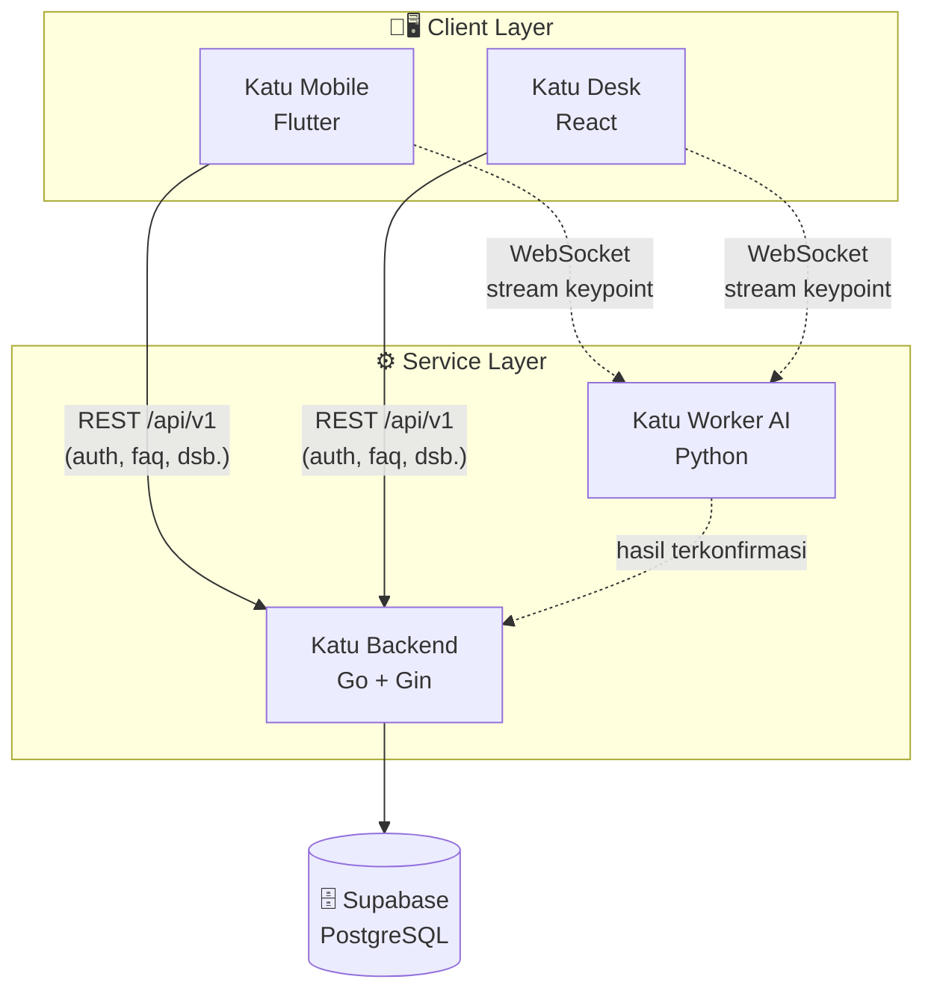
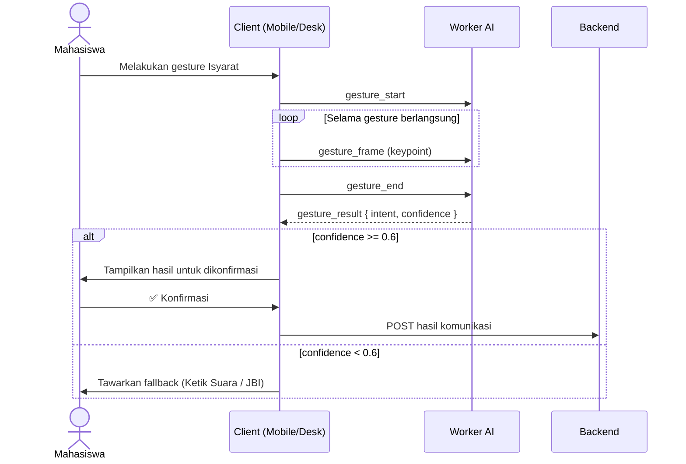

# 🤟 KATU

**Komunikasi Multimodal Inklusif untuk Mahasiswa Tuli guna Mewujudkan Ekosistem Layanan Akademik yang Aksesibel dan Berkelanjutan**

Dikembangkan oleh **Tim PREDATOR** untuk kompetisi **IFEST 2026** — tema *Tech for Human Connections*, sub-tema *Accessibility*.


---

## 1. 📖 Judul dan Deskripsi Proyek

Katu adalah alat bantu komunikasi multimodal yang dirancang untuk membantu mahasiswa Tuli berinteraksi secara mandiri dan setara dengan petugas layanan akademik kampus (loket TU, kemahasiswaan, akademik, dsb).

Alih-alih mengandalkan penerjemah BISINDO umum yang sulit tersedia setiap saat, Katu menggabungkan beberapa moda komunikasi ke dalam satu alur yang saling melengkapi, dengan prinsip inti:

- ✅ **Setiap pesan wajib dikonfirmasi oleh pengguna sebelum dikirim** — tidak ada output AI yang langsung diteruskan tanpa persetujuan.
- 🔁 **Fallback otomatis ke Ketik Suara / Juru Bahasa Isyarat (JBI)** jika sistem tidak cukup yakin dengan hasil deteksi.

Katu hadir dalam dua platform:

| Platform | Deskripsi |
|---|---|
| 📱 **Katu Mobile** | Aplikasi Flutter di device pribadi mahasiswa Tuli |
| 🖥️ **Katu Desk** | Aplikasi web (kiosk) di meja layanan, dipakai bersama oleh mahasiswa & petugas |

## 2. ✨ Fitur Utama (Features)

| Moda | Fungsi |
|---|---|
| 🔊 **Papan Suara** | Kartu preset kalimat/kata umum → dikonversi ke suara (Text-to-Speech) |
| ⌨️ **Ketik Suara** | Mahasiswa mengetik → teks dikonversi ke suara secara real-time untuk didengar petugas |
| 📝 **Transkrip** | Ucapan petugas (Speech-to-Text) → ditampilkan sebagai teks untuk dibaca mahasiswa |
| 🤚 **Isyarat** | Kamera menangkap gerakan tangan → diklasifikasikan ke 5–8 intent layanan terbatas (bukan penerjemah BISINDO umum), hasil wajib dikonfirmasi pengguna sebelum dikirim |

## 3. 🛠️ Teknologi yang Digunakan (Tech Stack)

| Service | Stack | Repo |
|---|---|---|
| Backend | Go + Gin, Supabase (database only) | `katu-backend` |
| Worker AI | Python + python-socketio, model dilatih di Kaggle | `katu-worker-ai` |
| Frontend Mobile | Flutter + Provider, local-first (Hive) | `katu-frontend-mobile` |
| Frontend Website | React (Vite) + Zustand | `katu-frontend-website` |
| Dokumentasi | Markdown/PDF lintas tim | `katu-docs` |

Autentikasi memakai skema custom (bcrypt + JWT access/refresh) yang diimplementasikan di Backend Go, **bukan** Supabase Auth.

### 🗺️ Arsitektur Sistem



> Catatan kunci: mode **Isyarat** terhubung **langsung** dari client ke Worker AI via WebSocket — **tidak** melewati Backend, supaya latensi klasifikasi gesture tetap rendah.

## 4. 🚀 Memulai (Getting Started)

### Prasyarat
- Go ≥ 1.21
- Python ≥ 3.10
- Node.js ≥ 18 (untuk Frontend Website)
- Flutter SDK (stable channel) untuk Frontend Mobile
- Akun & project Supabase (database)

### Struktur Repo
Proyek ini terbagi ke **4 repo layanan terpisah** + 1 repo dokumentasi:

```
katu-backend/            # Go + Gin
katu-worker-ai/          # Python + python-socketio
katu-frontend-mobile/    # Flutter
katu-frontend-website/   # React (Vite)
katu-docs/               # Dokumen lintas tim (API contract, panduan, dsb.)
```

### Menjalankan Seluruh Sistem
Karena Katu terdiri dari 4 service yang saling terhubung, setiap service perlu dijalankan bersamaan agar sistem berfungsi penuh:

1. Jalankan **Backend** (`katu-backend`) terlebih dahulu.
2. Jalankan **Worker AI** (`katu-worker-ai`).
3. Jalankan **Frontend Mobile** (`katu-frontend-mobile`) dan/atau **Frontend Website** (`katu-frontend-website`), arahkan environment variable-nya ke Backend & Worker AI yang sudah berjalan.

Untuk detail cara instalasi dan konfigurasi tiap service, lihat README masing-masing repo.

## 5. ▶️ Cara Penggunaan (Usage)

Alur pemakaian umum di lapangan:

1. Mahasiswa Tuli membuka Katu Mobile (atau menggunakan Katu Desk di meja layanan).
2. Memilih salah satu dari 4 moda komunikasi sesuai kebutuhan situasi.
3. Untuk moda **Isyarat**, mobile/website terhubung langsung ke Worker AI via WebSocket (tidak melalui Backend) untuk klasifikasi gesture real-time.
4. Hasil deteksi/teks yang dihasilkan sistem **selalu ditampilkan dulu ke pengguna untuk dikonfirmasi** sebelum benar-benar dikirim ke petugas.
5. Jika confidence sistem rendah (di bawah threshold), pengguna otomatis diarahkan ke fallback (Ketik Suara atau memanggil JBI).

### 🔁 Alur Konfirmasi Isyarat (prinsip inti Katu)



## 6. 📡 Dokumentasi API

Konvensi dasar kontrak API (REST & WebSocket) yang berlaku di seluruh sistem:

- Base URL: `/api/v1`
- Semua response REST mengikuti format `{ success, code, data/error }`
- Event WebSocket Isyarat: `gesture_start` / `gesture_frame` / `gesture_end` (client → worker), `gesture_result` / `gesture_error` (worker → client)
- Threshold confidence default: `0.6` (di bawah itu → `intent: null`, client wajib tawarkan fallback)

## 7. 🤝 Kontribusi (Contributing)

Proyek ini dikembangkan secara internal oleh Tim PREDATOR selama Hack Day IFEST 2026, mengikuti konvensi kode dan alur kerja yang sudah disepakati tim untuk masing-masing bahasa (Go/Python/Dart/JS).

Alur Git: setiap fitur dikerjakan di branch baru → Pull Request → wajib direview Git Manager sebelum merge ke `main`, untuk menghindari conflict antar anggota tim.

## 8. 📄 Lisensi (License)

Proyek ini dibuat khusus untuk keperluan kompetisi **IFEST 2026** dan bersifat internal milik Tim PREDATOR. Belum ada lisensi open-source resmi yang ditetapkan untuk distribusi publik.

## 9. 👥 Kontak / Tim

**Tim PREDATOR**

| Nama | Peran |
|---|---|
| Muhammad Arsal Nawfal Ali | Backend & Worker AI (Primary), Frontend Mobile (Secondary), Git Manager |
| Muhammad Naufal | Machine Learning & Backend (Primary), Fullstack Support |
| Farrel Raza Sigak Amrullah | Frontend Website (Primary) |
| Rhaihan Aditya Hidayat | Frontend Mobile (Primary), Frontend Website (Secondary) |
| Fanan Agfian Mozart | Frontend Website (Primary), Frontend Mobile (Secondary), UI/UX |
